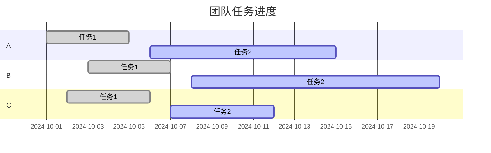

```mermaid
gantt
    title 团队任务进度
    dateFormat  YYYY-MM-DD
    section A
    任务1 :done, task1, 2024-10-01, 2024-10-05
    任务2 :active, task2, 2024-10-06, 2024-10-15
    section B
    任务1 :done, task3, 2024-10-03, 2024-10-07
    任务2 :active, task4, 2024-10-08, 2024-10-20
    section C
    任务1 :done, task5, 2024-10-02, 2024-10-06
    任务2 :active, task6, 2024-10-07, 2024-10-12

```