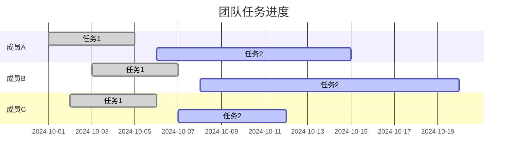

# git 配置步骤
```bash
sudo apt install git
在合适位置创建文件夹
mkdir Test
cd Test
git init
git config --global user.name "Your Name"
git config --global user.email "youremail@domain.com"

git remote add origin https://github.com/lelouch00000/2025_new_test.git
git pull origin master
git add .
git commit -m "first commit"
git push -u origin master

```

